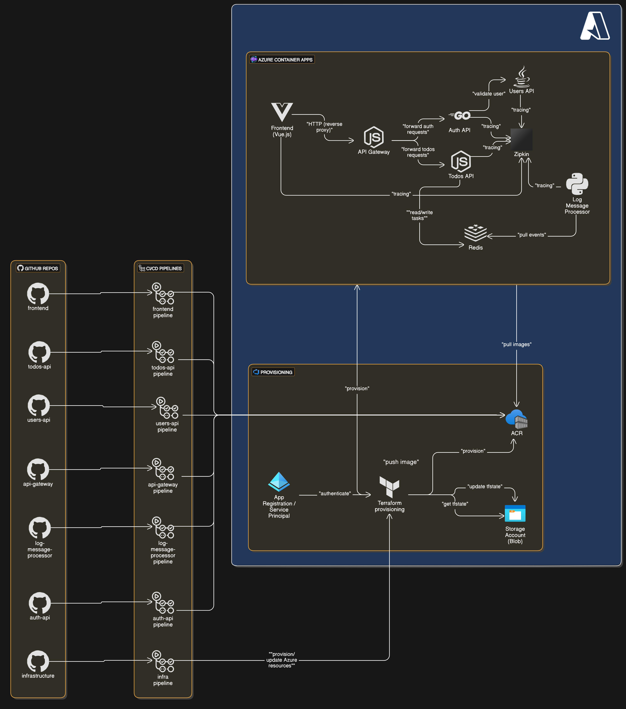

# Azure Microservices CI/CD Architecture

## Overview

This project describes a complete CI/CD architecture deployed on **Azure**, based on a **microservices architecture**.  
It uses separate GitHub repositories, GitHub Actions for CI/CD pipelines, Terraform for infrastructure as code, Ansible for configuration management, and Azure services like Virtual Machines, Docker, and Docker Compose.

All microservices follow well-established architectural patterns:  
- **API Gateway Pattern** for centralized request routing and access control.  
- **Health Check Pattern** for active health monitoring and auto-recovery of services.
---

## Architecture Components

### Repositories

- **Infrastructure Repository**:
  - Contains Terraform scripts, Ansible configurations, and Docker Compose files.
  - Manages all infrastructure provisioning through GitHub Actions.
  
- **Microservices Repositories**:
  - One repository per microservice:
    - `frontend`
    - `api-gateway`
    - `auth-api`
    - `users-api`
    - `todos-api`
    - `log-message-processor`
    
Each microservice repository includes its own CI/CD pipeline for building and pushing Docker images.

---

### Infrastructure Deployment (Terraform)

- Terraform provisions:
  - **Azure Virtual Machine** to host Docker and Docker Compose.
  - **Azure Storage Account** with a Blob Container to store the Terraform `tfstate`.
  - **External Configuration Store**: The pipeline saves the Virtual Machine's IP in Azure Key Vault for use by code pipelines during deployments.
  
- Authentication is handled through an **App Registration** and **Service Principal** with permission to push to ACR.
- The infrastructure pipeline is triggered by changes to the `main` branch of the infrastructure repository.

---

### CI/CD Workflow (GitHub Actions)

- **Infrastructure Pipeline**:
  - Trigger: Push to `main`.
  - Steps:
    - Authenticate with Azure.
    - Apply Terraform scripts.
    - Store the Virtual Machine's IP in Azure Key Vault.
  
- **Microservices Pipelines**:
  - Trigger: Push to `main`.
  - Steps:
    - Build Docker image.
    - Push Docker image to Azure Container Registry (ACR).
    - Retrieve the Virtual Machine IP from Key Vault.
    - Deploy microservices to the Virtual Machine via Docker Compose.

---

## Microservices and Communication

| Service                | Technology                  | Purpose                                                                                       |
|-------------------------|------------------------------|-----------------------------------------------------------------------------------------------|
| Frontend                | Vue.js + Node.js + NPM       | Serves web application and acts as reverse proxy to `Zipkin` and `api-gateway`                |
| API Gateway             | Node.js + Express            | Routes client requests to `auth-api` or `todos-api`, with circuit breaker and retry logic.    |
| Auth API                | Golang                       | Authenticates users via `users-api` and generates JWT tokens.                                 |
| Users API               | Java + Spring Boot           | Manages user data for authentication and validation.                                          |
| Todos API               | Node.js + Express            | Manages user tasks stored in `redis`.                                                         |
| Redis                   | Redis container              | Stores user tasks. **Deployed as an internal container**, not as a managed Azure service.     |
| Log Message Processor   | Python                       | Reads and logs events from `redis`.                                                           |
| Zipkin                  | Distributed Tracing Tool     | Receives traces from all services (except `redis` and `api-gateway`).                         |

---

## Architectural Patterns

### API Gateway Pattern

- The **API Gateway** acts as a single entry point for the frontend.
- Routes requests to backend services (`auth-api`, `todos-api`) based on URL paths.
- Implements a **circuit breaker** pattern to handle failed requests: after a certain number of failed requests, the gateway prevents further requests and retries them after a delay.
- Benefits:
  - Simplifies frontend client.
  - Centralizes authentication, logging, and routing.
  - Enables easier scalability and security.
  - Provides a safeguard against backend failures.

### Health Check Pattern

- Each microservice implements a **health check endpoint** (e.g., `/health`).
- Azure Virtual Machine uses these endpoints to automatically:
  - Monitor service health.
  - Restart unhealthy containers.
  - Route traffic only to healthy instances.

### External Configuration Store Pattern
- Application configuration values, such as the Azure VM IP address, are stored securely in an external key vault.
- The infrastructure pipeline saves VM details into the key vault.
- Code pipelines retrieve these configurations during deployment or runtime.

Benefits:

- Decouples configuration from application code.
- Enables dynamic updates without redeploying services.
- Strengthens security by keeping sensitive values out of code repositories.

---

## Infrastructure Diagram

## Summary

This architecture offers:
- Full CI/CD automation with GitHub Actions.
- Declarative and repeatable infrastructure management with Terraform.
- Strong separation of concerns using microservices.
- Monitoring and automatic healing through health checks.
- Circuit breaker logic in API Gateway for service resilience.
- Scalable and modular deployment using Azure Virtual Machine, Docker, and Docker Compose.

